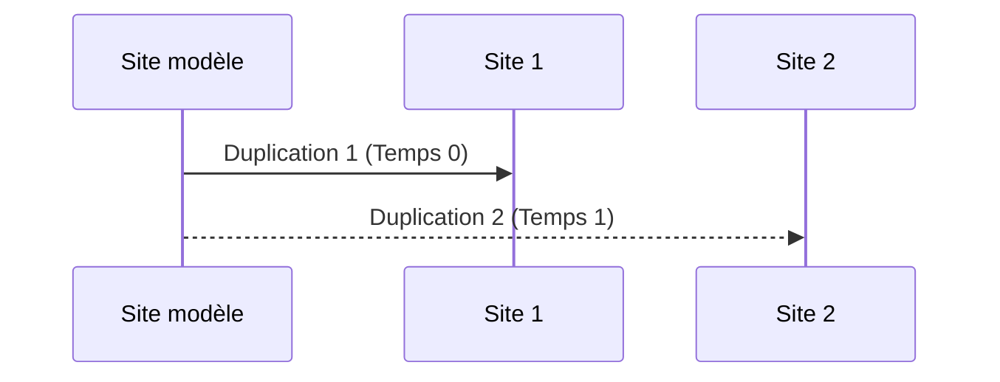
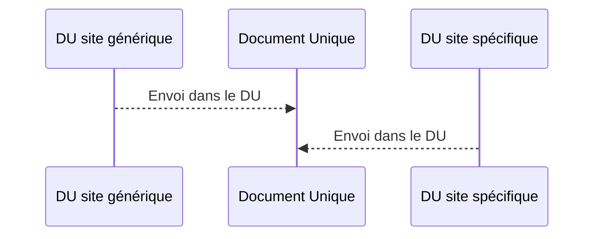

# DigiRisk-DashBoard
DigiRisk DashBoard permet de manager plusieurs installations de DigiRisk pour les grands groupes, collectivite de communes, franchisés, consultants, etc...

# Les fonctionalités de DigiRisk-DashBoard

## Indicateurs

Vous pouvez relier tous vos DigiRisk est centraliser vos indicateurs :
-Mise à jour de vos Document Unique
-Affichage légal, Diffusion d'informations
-Etc.

## Réalisation, Import, Export de sites modèle

La création d'un site modèle vous permmet de pré-étudier un site avec les éléments qui sont communs à tous. Vous pouvez ensuite exporter puis importer votre site sur les sites que vous souhaitez. Les avantages sont la simplicite, une base de travail commune.L'Inconvénient majeur est la non évolution de la base de travail.
Vous avez de nombreux sites identiques avec des variations comme par exemple les SDIS. Cette fonction peut vous faire gagner beaucoup de temps.

Site modèle

## Utilisation de site générique et combinaisons de Document Unique

La création d'un site générique est utilisé sur des sites qui presente de nombreux risques qui sont communs, souvent utiliser pour des franchisés. On réalise une étude des risques génériques puis on notera dans le site concerné que les risques lui étant propre.
L'impression du Document Unique sera composé de la sorte : DU = DU site générique + DU site concerné .
Il est à note que l'on peut faire un Document Composé de plusieurs sites.
L'avantage majeur est la prise en compte des évolutions du site générique.

Site générique

